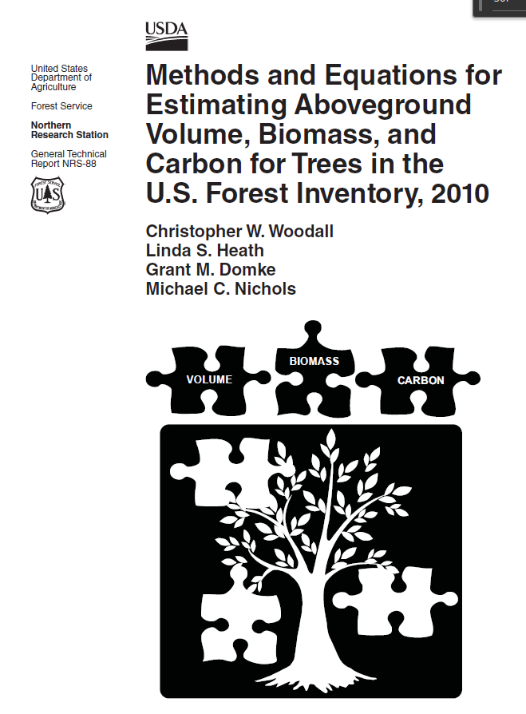

# crm

Files and R code to make predictions of tree volume, biomass, and carbon using the Component Ratio Method, as described in [Woodall et al. 2011](https://www.nrs.fs.usda.gov/pubs/gtr/gtr_nrs88.pdf).

Example provides calculations of volume, biomass and carbon for two trees (example 1 and 2 in Woodall et al. 2011). Examples can be followed in the eight steps provided in the Woodall et al. 2011 document.

Regional volume equations are available for these regions:

* Northeast
* North Central - Lake States
* North Central - Central States
* North Central - Prairie States
* South
* Rocky Mountains
* Pacific Northwest

